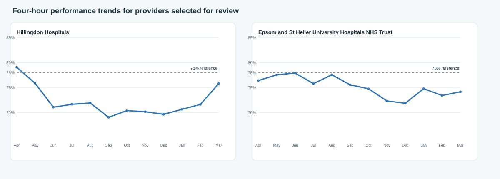

# Ad hoc investigation: four-hour performance deterioration with stable workforce FTE

## Question

Senior management asked why some providers experienced deteriorating four-hour A&E performance despite broadly stable workforce FTE.

## Executive summary

- **Two of the 20 London cohort providers met the pre-defined screening criteria:** Hillingdon Hospitals NHS Foundation Trust and Epsom and St Helier University Hospitals NHS Trust. Their March 2025 workforce FTE was within ±3.5% of April 2024, while four-hour performance was at least 2.0 percentage points lower.
- **Epsom and St Helier** showed a pattern consistent with reduced estimated availability and higher end-period activity: FTE was broadly flat (-0.7%), absence increased by 0.15 percentage points, estimated available FTE fell by 0.9%, and attendances increased by 4.4% between April and March. Four-hour performance fell by 2.2 percentage points.
- **Hillingdon** showed a more ambiguous pattern. FTE rose modestly (+3.0%) and estimated available FTE also rose (+2.0%), yet four-hour performance fell by 3.3 percentage points. Absence rose by 0.92 percentage points and over-four-hour attendances increased by 22.7%. The aggregate public data therefore does not explain the deterioration through workforce size or total attendance volume alone.
- **Do not infer causality.** The observed timing is useful for prioritising operational follow-up, but the public aggregate data does not include rota fill, skill mix by shift, acuity, bed occupancy, discharge flow, staff experience or local operational incidents.

## Scope and method

The analysis uses the reportable 20-provider London cohort and all 12 monthly observations from April 2024 to March 2025 (240 organisation-month records). Workforce FTE is aggregated from the staff-group workforce fact before comparison with organisation-level sickness absence and A&E activity.

Providers were selected only when both conditions held:

1. **Broadly stable workforce FTE:** April-to-March change within ±3.5%.
2. **Deteriorating four-hour performance:** March performance at least 2.0 percentage points below April.

The initial endpoint comparison is supplemented by a Q1 (April–June) versus Q4 (January–March) comparison. This sensitivity check reduces the risk of treating a single month as a sustained trend.

## Selection outcome

| Provider | FTE change, Apr→Mar | Four-hour performance, Apr→Mar | Selection result |
|---|---:|---:|---|
| Hillingdon Hospitals NHS Foundation Trust | +3.0% | -3.27 pp | Selected |
| Epsom and St Helier University Hospitals NHS Trust | -0.7% | -2.24 pp | Selected |
| Remaining 18 cohort providers | Did not meet both thresholds | Did not meet both thresholds | Not selected |

The full transparent screen is available in [`outputs/provider_selection_screen.csv`](outputs/provider_selection_screen.csv).

## What changed for the selected providers

| Provider | Absence change | Estimated available FTE change | Attendance change | Emergency-admission change | Over-four-hour attendance change | 12+ hour DTA-wait change |
|---|---:|---:|---:|---:|---:|---:|
| Hillingdon | +0.92 pp | +2.0% | +6.1% | -30.8% | +22.7% | 16 to 69 (+53) |
| Epsom and St Helier | +0.15 pp | -0.9% | +4.4% | +4.2% | +14.3% | +8.4% |

### Epsom and St Helier: availability pressure is a plausible contributor, not a proven cause

Workforce FTE was broadly unchanged from April to March, but higher sickness absence reduced the estimated available FTE proxy by 0.9%. At the same time, end-period A&E attendance and emergency admissions were both higher, while over-four-hour attendances rose 14.3%. This combination is consistent with added operational pressure despite a stable headline FTE number.

The Q1-to-Q4 sensitivity check strengthens the performance and availability pattern: four-hour performance fell by 3.16 percentage points, sickness absence rose by 0.64 percentage points and estimated available FTE fell by 0.79%. However, total Q4 attendances were 5.6% lower than Q1 while admissions were 1.8% higher. Total attendance volume is therefore not a sufficient explanation; changes in admission intensity, case mix, flow or capacity deployment remain unobserved.

**Classification:** availability pressure with an unresolved demand/flow component.

### Hillingdon: aggregate factors do not fully explain the deterioration

Hillingdon's March FTE was 3.0% higher than April, which meets the defined broadly-stable range but represents modest growth. Sickness absence increased by 0.92 percentage points and the endpoint attendance count was 6.1% higher. Despite this, estimated available FTE also increased by 2.0%, while over-four-hour attendances rose 22.7% and performance fell 3.27 percentage points.

The Q1-to-Q4 sensitivity check shows the same performance direction (-2.57 percentage points) but does **not** show a demand-volume increase: Q4 attendances were 1.9% lower than Q1 and estimated available FTE was 2.5% higher. Twelve-plus-hour DTA waits increased from 39 in Q1 to 242 in Q4, but the low Q1 base means the percentage change should not be interpreted in isolation.

**Classification:** unexplained aggregate performance deterioration; prioritise local operational investigation rather than attributing the change to workforce size or attendances alone.

## Interpretation for management

The investigation supports a narrower conclusion than “stable FTE should have protected performance.” Headline FTE is not equivalent to deployable capacity, and neither provider's pattern is fully explained by the public aggregate measures.

- For **Epsom and St Helier**, increased sickness absence and lower estimated availability coincided with poorer performance. The end-period demand signal also increased, although this was not sustained in the quarter-average comparison.
- For **Hillingdon**, higher absence and more over-four-hour attendances coincided with poorer performance, but the aggregate workforce and volume measures do not account for the size of the change.

These findings should be used to direct discussion, not to assess provider performance or assign causal responsibility.

## Recommended operational follow-up

1. Review ED staffing by shift: planned versus filled rota, agency use, skill mix and sickness coverage.
2. Compare arrival patterns, admissions conversion, acuity and ambulance arrivals with the same periods.
3. Review bed availability, discharge flow and decision-to-admit delays, especially for Hillingdon's increased 12+ hour waits.
4. Confirm any local service reconfiguration, data-submission changes or operational incidents before interpreting the trend as sustained.
5. Re-run this screen after each monthly refresh and escalate providers only when the deterioration persists across more than one reporting window.

## Data limitations

The public data is aggregate and monthly. It cannot establish causality or capture rota design, vacancy fill, staff experience, shift-level deployment, patient acuity, diagnostics, bed occupancy, discharge processes or other local operational changes. Estimated available FTE is an analytical proxy calculated as workforce FTE × (1 − sickness absence rate), not a measure of actual rostered staff.

## Reproducibility

Run [`four_hour_performance_investigation.ipynb`](four_hour_performance_investigation.ipynb) for a reader-facing, executed analysis notebook. The supporting [`analyse_four_hour_performance.py`](analyse_four_hour_performance.py) remains available as the headless reproducibility runner and recreates the selection screen, provider driver summary, monthly series and chart in `outputs/`. The analysis uses the preserved NHS public source files and the project workforce reporting extract.
