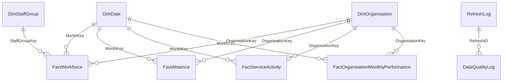

# NHS Workforce Capacity & Service Delivery Reporting

## Phase 4 — Data Model Design

## 1. Design objective

This model supports recurring monthly reporting in Excel Power Query, the Excel Data Model and Power BI. It preserves the natural grain of each NHS source and provides a separate organisation-month summary for safe cross-source comparison.

The central modelling rule is:

> Never join raw workforce staff-group rows directly to organisation-level absence or A&E rows.

Doing so would repeat organisation-level absence and service measures once for every staff group and could overstate FTE, attendances, admissions and waiting-time counts.

## 2. Recommended model

All relationships are active, one-to-many and single direction from the one-side table to the many-side table.

No fact-to-fact relationships are created.

## 3. Table grains

| Table | Type | Grain |
|---|---|---|
| `DimDate` | Dimension | One row per reporting month |
| `DimOrganisation` | Dimension | One row per controlled canonical organisation code |
| `DimStaffGroup` | Dimension | One row per accepted workforce staff group |
| `FactWorkforce` | Fact | Month × organisation × component staff group |
| `FactAbsence` | Fact | Month × organisation |
| `FactServiceActivity` | Fact | Month × organisation |
| `FactOrganisationMonthlyPerformance` | Summary fact | Month × controlled organisation |
| `DataQualityLog` | Control fact | Refresh × dataset × rule × optional month/organisation |
| `RefreshLog` | Control header | One row per refresh run |

Detailed columns, keys, derivations and checks are documented in `data_model_design.xlsx`.

## 4. Workforce total handling

The workforce source contains both component staff groups and an aggregate `Staff Group = Total` row.

To prevent double counting:

1. `FactWorkforce` contains component staff groups only.
2. The official `Staff Group = Total` rows are handled in a separate connection-only query named `wrkWorkforceOrgMonth`.
3. `wrkWorkforceOrgMonth` is unique at Month × Organisation after `HC` and `FTE` are pivoted into separate columns.
4. The official organisation-level Headcount and FTE values are used in `FactOrganisationMonthlyPerformance`.
5. Component staff-group sums are reconciled to the official total and any difference is logged rather than silently overwritten.

## 5. Safe organisation-month summary

`FactOrganisationMonthlyPerformance` is built only after each source is unique at the shared reporting grain:

- Workforce: Month × Organisation, filtered to `Staff Group = Total`
- Absence: Month × Organisation
- Service activity: Month × Organisation, excluding the published `TOTAL` row

The three source aggregates are left-joined to a controlled organisation-month scaffold. The summary retains:

- `WorkforceMatchFlag`
- `AbsenceMatchFlag`
- `ServiceMatchFlag`
- `AllSourcesMatchedFlag`
- `FixedCohortFlag`
- `DataQualityStatus`

Unmatched values remain null. They are not converted to zero and are not silently removed by an inner join.

## 6. Model relationship rules

- Use `MonthKey` in `YYYYMM` format for monthly relationships.
- Use a controlled canonical organisation code as `OrganisationKey`.
- Use the confirmed workforce staff-group sort order as `StaffGroupKey` only after uniqueness validation.
- Filter direction is always dimension to fact.
- `DimStaffGroup` relates only to `FactWorkforce`.
- `FactOrganisationMonthlyPerformance` shares dimensions with the base facts but is not related to them.
- `DataQualityLog` relates only to `RefreshLog` in the first model version.
- Source organisation names are display attributes, never join keys.

## 7. Power Query responsibility

Power Query should perform:

- file combination and schema selection;
- date and organisation-code standardisation;
- source-row validation;
- workforce `HC`/`FTE` pivoting;
- source-specific organisation-month aggregation;
- controlled reference matching;
- summary-table joins;
- match flags and safe proxy calculations;
- refresh and data-quality output preparation.

The Excel Data Model and Power BI should provide:

- one-to-many relationships;
- shared filtering from dimensions;
- measures and report calculations;
- PivotTable and dashboard presentation.

## 8. Required anti-duplication controls

Before publishing:

1. verify every documented primary key is unique;
2. confirm all foreign keys match their dimensions;
3. confirm `FactWorkforce` contains no Total staff-group rows;
4. confirm the three summary inputs are individually unique at Month × Organisation;
5. confirm the summary row count equals the scaffold row count;
6. confirm no published A&E `TOTAL` row is present in `FactServiceActivity`;
7. confirm booked-appointment fields are not added again to headline attendance measures;
8. reconcile source, accepted, rejected, aggregate and revised rows;
9. log all unexplained differences in `DataQualityLog`;
10. publish only after the refresh status is approved.

## 9. Scope boundary

This is a deliberately simple reporting model suitable for a junior or associate reporting analyst.

The first version does not require:

- patient-level or employee-level data;
- daily date dimensions;
- many-to-many relationships;
- bidirectional filtering;
- direct fact-to-fact relationships;
- a slowly changing dimension framework;
- historical copies of every fact row for every refresh;
- staff-group absence analysis, because the selected absence files do not contain staff group.

Source versions remain recoverable through the raw archive, file manifest, revision comparison and refresh logs.

